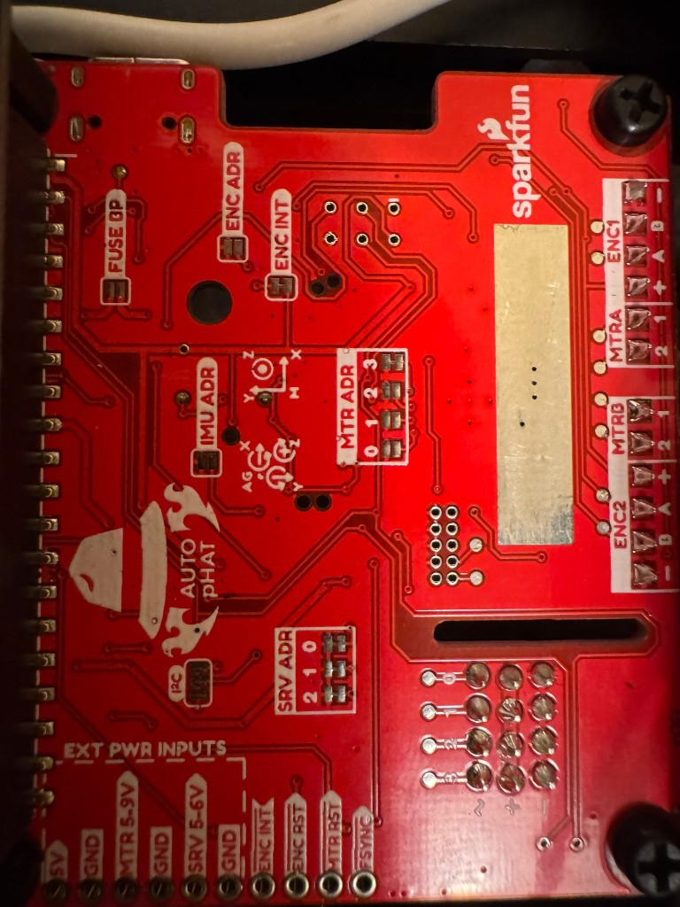
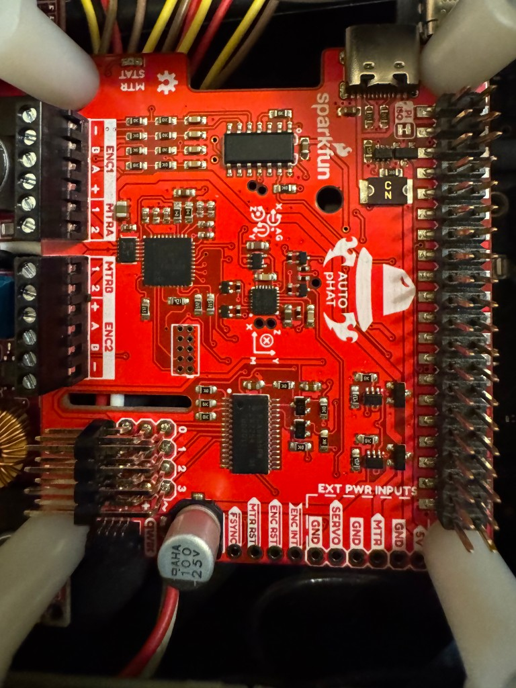

# SparkFun Auto pHAT Hardware Documentation

Complete hardware reference for the SparkFun Auto pHAT for Raspberry Pi (ROB-16328) as used with the Jetson Orin Nano.

## Board Identification

- **Product Name**: SparkFun Auto pHAT for Raspberry Pi
- **SKU**: ROB-16328
- **Manufacturer**: SparkFun Electronics
- **Form Factor**: Raspberry Pi pHAT (40-pin GPIO compatible)
- **Dimensions**: 57mm x 65mm

## Overview

The SparkFun Auto pHAT is an all-in-one robotics control board designed for Raspberry Pi but also compatible with other single-board computers with a 40-pin GPIO header, including the NVIDIA Jetson Orin Nano.

### Key Features

- **4-Channel Servo Controller** (PCA9685)
- **2-Channel DC Motor Driver** (PSoC 4245 + DRV8835)
- **Dual Encoder Reader** (ATtiny84)
- **9-DoF IMU** (ICM-20948: 3-axis gyro, accelerometer, magnetometer)
- **Qwiic Connector** for I2C expansion
- **USB-C Power Input** (can power both motors and host SBC)

## Board Photos

### Front View

**Key Components Visible (Front):**
- PCA9685 servo controller (center, large IC)
- ICM-20948 IMU (small IC near top)
- Servo headers (3x4 right-angle, white)
- Motor terminal blocks (left side, black)
- Encoder terminal blocks (bottom)
- USB-C connector (right side)
- Qwiic connector (top right, white)

### Back View

**Key Components Visible (Back):**
- 40-pin GPIO connector (top)
- Configuration jumpers:
  - SRV ADD (servo address, A0-A5)
  - IMU ADD (IMU address)
  - MTR ADD (motor address)
  - ENC ADD (encoder address)
- External power input pins (bottom)

## Component Layout

### I2C Devices

All components communicate via I2C bus on GPIO pins 3 (SDA) and 5 (SCL):

| Component | IC | Default Address | Configurable Range | Jumper |
|-----------|----|-----------------|--------------------|--------|
| Servo Controller | PCA9685 | 0x40 | 0x40 - 0x47 | SRV ADD (A0-A5) |
| IMU | ICM-20948 | 0x69 | 0x68 - 0x69 | IMU ADD (AD0) |
| Motor Driver | PSoC 4245 | 0x5D | 0x58 - 0x61 | MTR ADD |
| Encoder Reader | ATtiny84 | 0x73 | (fixed) | ENC ADD |

### Power Connections

The Auto pHAT can be powered in multiple ways:

1. **Through GPIO Header** - 5V from Raspberry Pi/Jetson
2. **USB-C Connector** - Can power both motors and host SBC
3. **External Power PTH Pins**:
   - `5V` - Regulated 5V only
   - `SERVO` - Up to 6V for servos
   - `MTR` - Up to 9V (11V with heatsink) for motors

**Important**: Reverse current protection is included on the 5V line.

## GPIO Pin Usage

### Jetson Orin Nano Mapping

The Auto pHAT uses the following GPIO pins when connected to a Jetson Orin Nano:

| Pin # | GPIO | Function | Used By |
|-------|------|----------|---------|
| 1, 17 | 3.3V | Power | All ICs |
| 2, 4 | 5V | Power | All ICs |
| 3 | GPIO 2 (SDA) | I2C Data | All I2C devices |
| 5 | GPIO 3 (SCL) | I2C Clock | All I2C devices |
| 7 | GPIO 4 | Interrupt | Encoder Reader |
| 26 | GPIO 7 | Interrupt | IMU |
| 6, 9, 14, 20, 30, 34, 39 | GND | Ground | All |

**Critical Note**: The Jetson Orin Nano I2C bus 7 maps to GPIO pins 3/5, which is different from Raspberry Pi's I2C bus 1 on the same physical pins.

### Raspberry Pi Mapping

For reference, on Raspberry Pi:
- GPIO 2/3 → I2C Bus 1
- Same physical pins (3/5) as Jetson

## Hardware Variants and Revisions

This documentation is based on the standard production version of the Auto pHAT (ROB-16328). Check the SparkFun GitHub repository for the latest hardware revisions and changes.

## Related Documentation

- [SPECIFICATIONS.md](SPECIFICATIONS.md) - Detailed technical specifications for all components
- [JUMPER_CONFIGURATION.md](JUMPER_CONFIGURATION.md) - Complete jumper configuration guide
- [I2C_TROUBLESHOOTING.md](I2C_TROUBLESHOOTING.md) - I2C debugging and troubleshooting procedures
- [datasheets/](datasheets/) - Official schematics and component datasheets

## External Resources

- **Product Page**: https://www.sparkfun.com/products/16328
- **Hookup Guide**: https://learn.sparkfun.com/tutorials/sparkfun-auto-phat-hookup-guide
- **GitHub Repository**: https://github.com/sparkfun/SparkFun_Auto_pHAT
- **Schematic PDF**: See `datasheets/SparkFun_Auto_pHAT_Schematic.pdf`

## License

SparkFun Auto pHAT hardware is released under Creative Commons Attribution Share-Alike 4.0 License.

This documentation is part of the Isaac Robot project and follows the same open-source principles.
